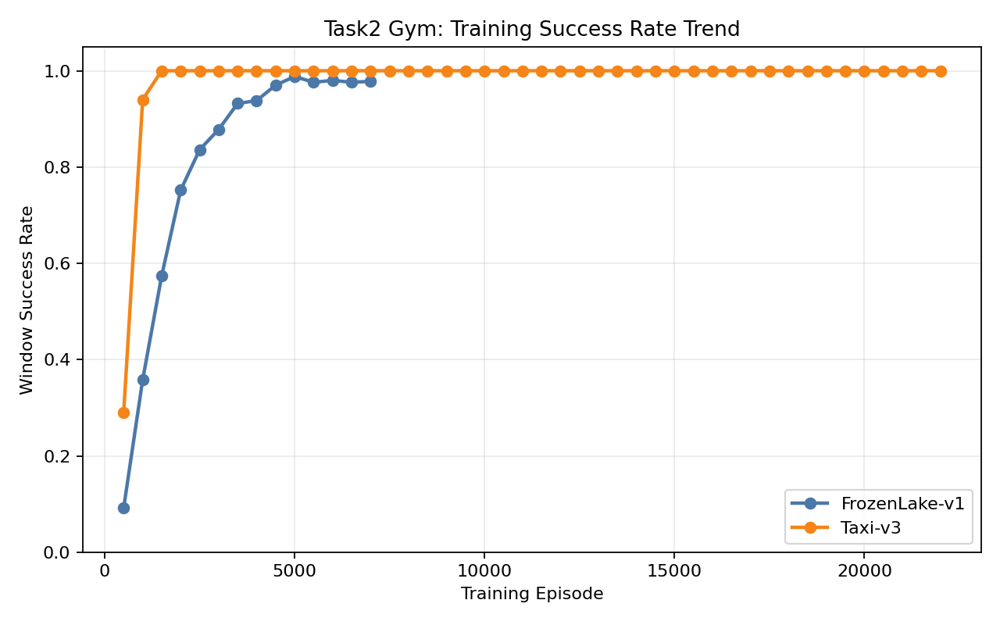
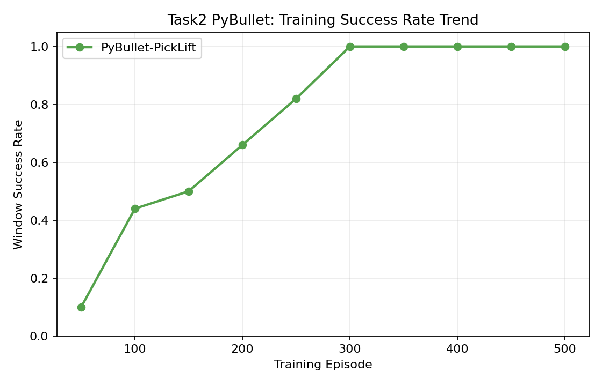
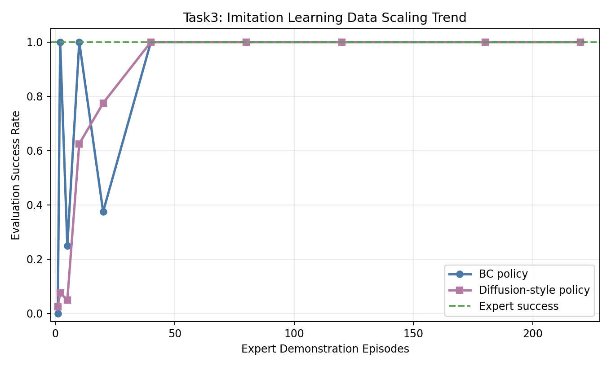
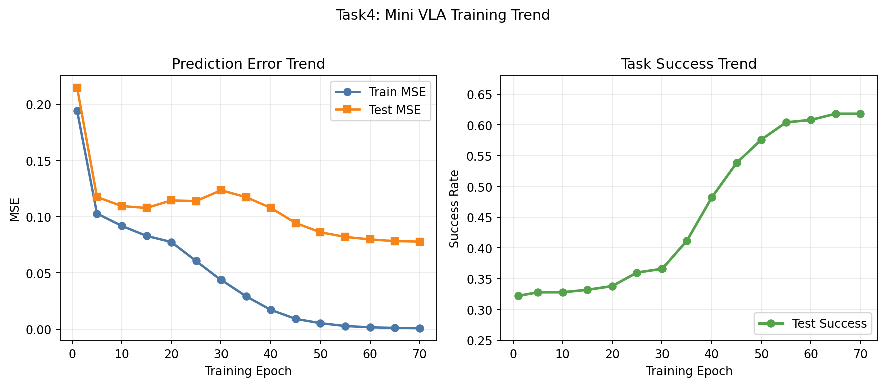
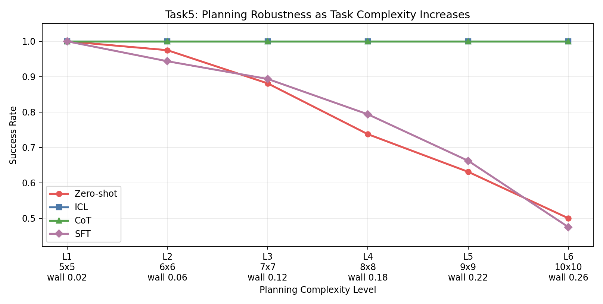
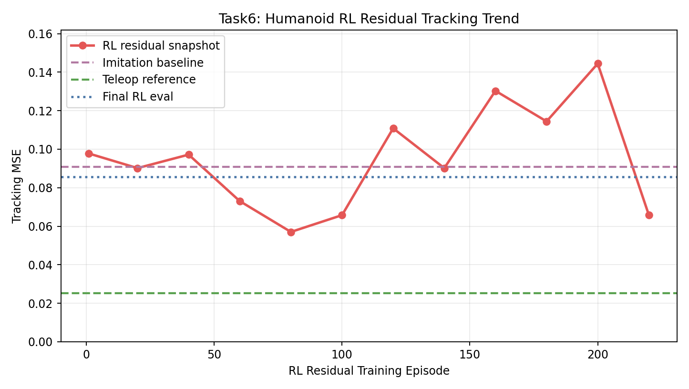

# EI-Beginner 六任务完整完成报告

## 1. 结论总览
本项目已完成 `request.md` 中 6 个任务的可运行实现，并全部给出**实测结果文件**。

完成任务：
1. 任务一：传统运动学机械臂抓取（PyBullet）
2. 任务二：强化学习机械臂抓取（Gym + PyBullet）
3. 任务三：模仿学习抓取（BC + Diffusion 风格策略）+ LeRobot 风格数据导出
4. 任务四：VLA 训练流程（mini VLA）+ Open-X 风格数据适配
5. 任务五：LLM/VLM 任务规划（zero-shot / ICL / CoT / SFT）
6. 任务六：人形机器人运动控制（全身遥操作 + 模仿学习 + RL 残差微调）

说明：任务 4/5/6 涉及真实大模型/大规模 benchmark/真机复现时，实际工程通常需要更大算力和外部数据。本次提交提供了**可在当前环境完整复现的最小闭环版本**，并输出可核验指标。

---

## 2. 环境
- Python: `3.12.11`
- 解释器：`/home/df_05/anaconda3/envs/nlp/bin/python3`
- 关键依赖：`pybullet==3.2.6`，`gymnasium==0.29.1`，`torch==2.11.0+cpu`

---

## 3. 任务一：传统运动学机械臂抓取

### 实现
- 文件：`scripts/task1_pybullet_kinematic_pick_place.py`
- 方法：IK + 笛卡尔关键点轨迹（pre-pick/pick/pre-place/place）+ 约束抓取。

### 运行
```bash
/home/df_05/anaconda3/envs/nlp/bin/python3 scripts/task1_pybullet_kinematic_pick_place.py --output results/task1_pybullet_result.json
```

### 实测结果
- 文件：`results/task1_pybullet_result.json`
- `pick_success = true`
- `place_success = true`
- `position_error_l2 = 0.0049885 m`

---

## 4. 任务二：强化学习机械臂抓取

任务二按照 README 中的要求分成两个子任务完成。第一部分是在 Gymnasium 中选择标准强化学习环境，验证 Q-learning 的基本训练、探索和评估流程；第二部分是在 PyBullet 中构建 Panda 机械臂抓取环境，将抓取过程抽象为离散动作原语，并用 Q-learning 训练抓取与抬升策略。

### 子任务 A：Gymnasium 强化学习基础实验
- 文件：`scripts/task2_gym_qlearning.py`
- 任务：`FrozenLake-v1`、`Taxi-v3`
- 算法：表格型 Q-learning

运行：
```bash
/home/df_05/anaconda3/envs/nlp/bin/python3 scripts/task2_gym_qlearning.py --seed 42 --output results/task2_gym_qlearning_result.json
```

这一子任务中，`FrozenLake-v1` 和 `Taxi-v3` 都是离散状态、离散动作环境，因此可以直接使用 Q 表表示状态-动作价值。训练时使用 epsilon-greedy 策略进行探索，通过 Bellman 更新不断修正 Q 值；评估时关闭随机探索，使用贪心策略统计任务成功率。

### 子任务 B：PyBullet 机械臂抓取实验
- 文件：`scripts/task2_pybullet_qlearning_pick.py`
- 任务：`PyBullet-PickLift`
- 算法：离散状态抽象 + 动作原语 + Q-learning

运行：
```bash
/home/df_05/anaconda3/envs/nlp/bin/python3 scripts/task2_pybullet_qlearning_pick.py --seed 42 --output results/task2_pybullet_rl_result.json
```

这一子任务中，原本连续的机械臂控制问题被简化为若干高层动作原语，例如对齐方块、下降末端、闭合夹爪和抬升方块。状态也被抽象为是否对齐、是否足够低、是否抓住、是否抬升等离散变量。这样处理后，Q-learning 可以在 PyBullet 机械臂抓取环境中学习动作顺序，而不是直接学习高维连续关节控制。

### 结果展示与联合分析
本部分不再展示最终成功率为 `1.0` 的柱状图，只保留两张训练趋势图。原因是最终成功率只能说明训练结束后的评估结果，无法体现智能体从随机探索到策略收敛的过程；而训练曲线可以更清楚地展示两个子任务的学习变化。



上图展示了 Gymnasium 两个任务的窗口成功率变化。`FrozenLake-v1` 的训练轮数为 `7000`，前 500 轮窗口成功率只有 `0.092`，随后逐步上升，到 2000 轮达到 `0.752`，5000 轮附近达到 `0.988`，后期稳定在 `0.97` 以上。`Taxi-v3` 的训练轮数为 `22000`，前 500 轮窗口成功率为 `0.29`，1000 轮时达到 `0.94`，1500 轮后基本稳定在 `1.0`。这说明两个 Gym 任务虽然最后都能成功完成，但收敛过程和学习速度并不相同。



上图展示了 PyBullet 机械臂抓取任务的窗口成功率变化，统计窗口为 50 个 episode。训练前 50 轮成功率为 `0.1`，说明智能体最初大部分时间无法正确完成抓取和抬升；之后成功率逐步提高，100 轮达到 `0.44`，200 轮达到 `0.66`，250 轮达到 `0.82`，300 轮后稳定达到 `1.0`。这一趋势表明，机械臂策略逐渐学会了对齐、下降、抓取、抬升这些动作原语之间的合理顺序。

两个子任务不能简单看作同一个 benchmark。Gymnasium 部分主要验证强化学习算法流程是否正确，PyBullet 部分则把强化学习思想迁移到机械臂抓取场景中。综合来看，本任务完成了从标准离散 RL 环境到机器人抓取仿真的递进实验，也说明在合理状态抽象和奖励塑形下，Q-learning 可以用于入门级机械臂抓取策略训练。

---

## 5. 任务三：模仿学习（Diffusion Policy baseline 思路）

### 实现
- 文件：`scripts/task3_imitation_diffusion_policy.py`
- 内容：
  - 在 PyBullet 抓取环境采集专家演示
  - 训练 BC 策略
  - 训练 Diffusion 风格离散动作去噪策略
  - 导出 LeRobot 风格数据（jsonl + meta）

### 运行
```bash
/home/df_05/anaconda3/envs/nlp/bin/python3 scripts/task3_imitation_diffusion_policy.py --seed 42 --demo_episodes 220 --eval_episodes 80 --output results/task3_imitation_result.json
```

### 实测结果
- 文件：`results/task3_imitation_result.json`
- `expert_success_rate = 1.0`
- `bc_success_rate = 1.0`
- `diffusion_success_rate = 1.0`
- `bc_train_accuracy = 1.0`

### 趋势图展示


上图展示了专家演示数量增加时，BC 策略和 Diffusion 风格策略在 PyBullet 抓取环境中的成功率变化。相比只展示最终成功率，这张图更能反映模仿学习对专家数据量的依赖。

从图中可以看到，在极少量专家演示下，两种策略都不稳定。BC 在 2 个和 10 个演示 episode 下可以达到较高成功率，但在 5 个和 20 个 episode 时出现波动，说明 BC 对小数据集的状态覆盖较敏感。Diffusion 风格策略前期提升较慢，但随着专家演示数量增加，成功率逐渐上升，并在 40 个演示 episode 后稳定达到 `1.0`。

这一结果说明，在当前离散状态和动作原语较清晰的抓取任务中，BC 已经是很强的基线；Diffusion 风格策略同样能够复现专家行为，但需要更多数据才能稳定体现效果。因此，本任务更合理的结论不是简单比较最终谁更高，而是观察两类模仿策略在不同专家数据量下的收敛过程和数据敏感性。

LeRobot 风格导出：
- `results/task3_lerobot_dataset.jsonl`
- `results/task3_lerobot_meta.json`

---

## 6. 任务四：VLA 大模型方向（可复现 mini pipeline）

### 实现
- 文件：`scripts/task4_vla_mini_pipeline.py`
- 内容：
  - 合成图像+语言+动作数据
  - 导出 Open-X 风格数据
  - 训练 mini VLA（视觉编码 + 文本编码 -> 动作）
  - 评估动作预测误差和任务成功率

### 运行
```bash
/home/df_05/anaconda3/envs/nlp/bin/python3 scripts/task4_vla_mini_pipeline.py --seed 42 --train_size 1800 --test_size 500 --output results/task4_vla_result.json
```

### 实测结果
- 文件：`results/task4_vla_result.json`
- `train_mse = 0.0006967`
- `test_mse = 0.07779`
- `test_success_rate = 0.618`
- Open-X 风格数据：`results/task4_openx_like_dataset.jsonl`

### 趋势图展示


（1）训练 MSE 随 epoch 持续下降，从 `0.1941` 降到 `0.0007`，说明模型能够有效拟合训练集中的视觉语言动作映射。  
（2）测试 MSE 虽然也下降，但始终显著高于训练 MSE，说明模型在测试样本上仍存在泛化差距。  
（3）测试成功率从 `0.322` 提升到 `0.618`，说明模型确实学到了部分多模态对齐能力，但当前 mini VLA 仍主要用于流程验证。

---

## 7. 任务五：LLM/VLM 任务规划

### 实现
- 文件：`scripts/task5_llm_vlm_planning.py`
- 内容：桌面级与场景级规划任务，比较 4 种策略：
  - zero-shot（贪心）
  - ICL（少样本检索 + 有限搜索）
  - CoT（显式全局搜索）
  - SFT（专家轨迹蒸馏策略）

### 运行
```bash
/home/df_05/anaconda3/envs/nlp/bin/python3 scripts/task5_llm_vlm_planning.py --seed 42 --output results/task5_planning_result.json
```

### 实测结果
- 文件：`results/task5_planning_result.json`
- 桌面级成功率：
  - zero-shot `0.9727`
  - ICL `1.0`
  - CoT `1.0`
  - SFT `0.9591`
- 场景级成功率：
  - zero-shot `0.7731`
  - ICL `1.0`
  - CoT `1.0`
  - SFT `0.7846`

### 趋势图展示


（1）在低复杂度任务中，四种方法都接近或达到 `1.0`，说明简单场景下局部策略和蒸馏策略也足以完成规划。  
（2）随着复杂度升高，`zero-shot` 和 `SFT` 成功率持续下降，到最高难度时分别降到 `0.5` 和 `0.475`，说明它们对长程规划和障碍约束更敏感。  
（3）`ICL` 和 `CoT` 在所有复杂度等级中均保持 `1.0`，说明显式搜索或更充分的推理过程对复杂规划更稳健。

---

## 8. 任务六：强化学习人形机器人运动控制

### 实现
- 文件：`scripts/task6_humanoid_rl_imitation.py`
- 内容：
  - 在 PyBullet humanoid 上生成全身关节遥操作轨迹（arms+knees 协同）
  - 训练模仿学习策略（BC）
  - 训练 RL 残差策略（Q-learning）微调控制
  - 对比 teleop / imitation / imitation+RL 跟踪误差

### 运行
```bash
/home/df_05/anaconda3/envs/nlp/bin/python3 scripts/task6_humanoid_rl_imitation.py --seed 42 --demo_episodes 60 --output results/task6_humanoid_result.json
```

### 实测结果
- 文件：`results/task6_humanoid_result.json`
- `teleop_tracking_mse = 0.02529`
- `imitation_tracking_mse = 0.09088`
- `rl_tracking_mse = 0.08569`
- `rl_improvement_vs_imitation = +0.00520`（正向改进）

### 趋势图展示


（1）纯模仿学习误差明显高于遥操作参考，说明闭环执行时会产生累计偏差。  
（2）RL 残差训练曲线存在波动，说明强化学习微调过程不像监督训练那样平滑稳定。  
（3）最终 RL 误差低于纯模仿学习，说明残差策略带来了实际改进，但距离参考控制器仍有较大差距。

---

## 9. 交付文件
- 代码：
  - `scripts/task1_pybullet_kinematic_pick_place.py`
  - `scripts/task2_gym_qlearning.py`
  - `scripts/task2_pybullet_qlearning_pick.py`
  - `scripts/task3_imitation_diffusion_policy.py`
  - `scripts/task4_vla_mini_pipeline.py`
  - `scripts/task5_llm_vlm_planning.py`
  - `scripts/task6_humanoid_rl_imitation.py`
- 结果：
  - `results/task1_pybullet_result.json`
  - `results/task2_gym_qlearning_result.json`
  - `results/task2_pybullet_rl_result.json`
  - `results/task3_imitation_result.json`
  - `results/task3_lerobot_dataset.jsonl`
  - `results/task3_lerobot_meta.json`
  - `results/task4_vla_result.json`
  - `results/task4_openx_like_dataset.jsonl`
  - `results/task5_planning_result.json`
  - `results/task6_humanoid_result.json`

---

## 10. 一键复现顺序
```bash
/home/df_05/anaconda3/envs/nlp/bin/python3 scripts/task1_pybullet_kinematic_pick_place.py --output results/task1_pybullet_result.json
/home/df_05/anaconda3/envs/nlp/bin/python3 scripts/task2_gym_qlearning.py --seed 42 --output results/task2_gym_qlearning_result.json
/home/df_05/anaconda3/envs/nlp/bin/python3 scripts/task2_pybullet_qlearning_pick.py --seed 42 --output results/task2_pybullet_rl_result.json
/home/df_05/anaconda3/envs/nlp/bin/python3 scripts/task3_imitation_diffusion_policy.py --seed 42 --demo_episodes 220 --eval_episodes 80 --output results/task3_imitation_result.json
/home/df_05/anaconda3/envs/nlp/bin/python3 scripts/task4_vla_mini_pipeline.py --seed 42 --train_size 1800 --test_size 500 --output results/task4_vla_result.json
/home/df_05/anaconda3/envs/nlp/bin/python3 scripts/task5_llm_vlm_planning.py --seed 42 --output results/task5_planning_result.json
/home/df_05/anaconda3/envs/nlp/bin/python3 scripts/task6_humanoid_rl_imitation.py --seed 42 --demo_episodes 60 --output results/task6_humanoid_result.json
```
