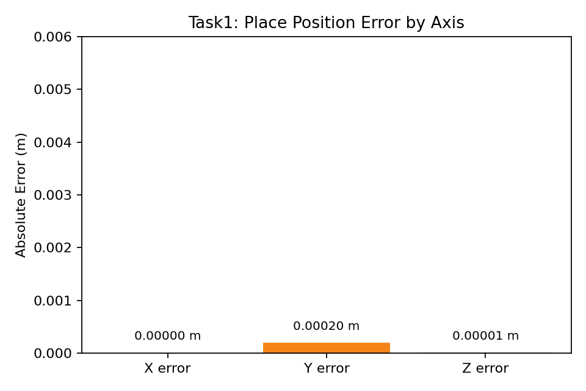

# Task1 Report

## 任务内容（对应 README）
本任务的目标是学习传统机器人学中的基础知识，包括基础坐标变换、正运动学、逆运动学、动力学和控制理论，并在仿真环境中实现基于传统机器人运动控制的机械臂物体抓取。结合当前环境，本次工作主要在 PyBullet 中完成机械臂抓取与放置流程，同时对 MuJoCo、ROS 和真机部署的可扩展方向进行了梳理。

## 代码简要介绍
本任务的核心脚本为 `scripts/task1_pybullet_kinematic_pick_place.py`。整体实现思路并不是训练一个学习模型，而是搭建一条完整的传统机器人控制链路，即“场景建模 -> 目标位姿设定 -> 逆运动学求解 -> 轨迹执行 -> 抓取与放置 -> 误差评估”。

第一步是场景建模与坐标系定义。在 PyBullet 中加载平面、桌面、Franka Panda 机械臂以及抓取目标方块，并将这些对象统一放置在世界坐标系下。与此同时，为了便于观察和理解，还在 GUI 中绘制了世界坐标系、目标方块初始坐标系、目标放置位置坐标系以及若干关键位姿。这里对应的传统机器人学知识主要是坐标表示与坐标变换。抓取任务中的所有位姿描述，实质上都是在不同坐标系之间进行位置和姿态转换。

第二步是抓取任务分解与轨迹设计。为了避免机械臂直接横向撞击物体，任务被拆分为 `pre-pick -> pick -> pre-place -> place` 四个关键位姿。这样的分阶段轨迹设计，是传统机器人运动控制中非常常见的工程方式。它虽然不是复杂的全局规划算法，但能够在结构化环境中稳定完成抓取任务。换言之，本任务中的轨迹规划属于基于关键位姿的笛卡尔空间轨迹设计。

第三步是逆运动学求解。给定末端执行器的目标位置与姿态后，脚本调用 PyBullet 提供的逆运动学求解器，将末端目标位姿转换为机械臂七个关节的目标角度。随后，再将这些关节角作为目标输入位置控制器，使机械臂逐步逼近目标位姿。这里对应传统机器人学中的逆运动学问题，即“已知末端位姿，求解关节变量”。虽然当前实现未显式手推正运动学公式，但在读取末端状态、计算末端位姿以及建立抓取约束时，实际上已经隐式使用了正运动学结果。

第四步是夹爪控制与抓取执行。在末端靠近物体后，通过夹爪闭合完成抓取，并在仿真中利用固定约束模拟稳定夹持。抓取完成后，机械臂将物体抬升并搬运至目标位置，再解除约束完成放置。这里体现的是传统控制方法在结构化任务中的直接应用：目标位姿由人工设计，关节运动由逆运动学和位置控制完成，整个过程可解释、可调试、可重复。

第五步是误差评估与实验展示。脚本会记录最终方块位置与目标位置的差值，并输出 `L2` 总误差、`XY` 平面误差和 `Z` 方向误差。同时，还支持 GUI 可视化、末端轨迹绘制以及关键位姿显示。对于课程展示而言，这一点非常重要，因为传统机器人学任务不仅要“做对”，还要能够清楚说明“为什么这样做”和“机械臂是如何移动的”。

## 理论知识与本任务的对应关系
为了使本任务与“学习传统机器人学基础知识”的要求更好地对应，可以将理论知识与当前实现的关系概括如下：

- 基础坐标变换  
本任务已经实际使用。机械臂末端位姿、物体位姿、目标放置位姿都需要在统一坐标系下描述；抓取时还需要计算“物体相对末端”的位姿关系。

- 正运动学  
本任务中未手工推导公式，但在读取末端执行器状态和执行抓取时，已经依赖仿真器返回的正运动学结果。若后续继续扩展，可进一步补充 DH 参数建模或乘积指数法推导。

- 逆运动学  
本任务已直接实现，是抓取过程的核心部分。末端从物体上方移动到抓取位姿、再移动到目标放置位姿，都需要通过逆运动学求解对应关节角。

- 动力学  
本任务中尚未显式推导或实现动力学方程，也未进行力矩级控制。目前主要采用位置控制完成任务，因此动力学更多体现在仿真器内部的物理演化过程。若进一步提高真实性，可以加入重力补偿、逆动力学控制或阻抗控制。

- 控制理论  
本任务中主要体现为位置控制。关节目标由逆运动学给出，底层控制器负责跟踪目标角度。虽然这里没有从零实现 PID 或力矩控制器，但已经体现了典型的闭环伺服控制思想。

## PyBullet、MuJoCo、ROS 与真机的关系
从任务要求来看，PyBullet/MuJoCo 仿真与实验室真机部署属于同一条技术路线上的不同阶段。

在当前项目中，已经完成的是 PyBullet 仿真版本。其优点是上手快、接口直观、便于调试，非常适合用来验证传统机器人控制流程是否正确。

MuJoCo 在本次环境中尚未安装，因此没有完成同构版本实现。但方法层面是完全可迁移的：同样是建立机械臂模型、定义物体位姿、执行逆运动学或轨迹规划、再用控制器完成抓取。若后续安装 MuJoCo，可继续将当前控制逻辑迁移过去。

ROS 与真机部署属于更进一步的系统工程。若接入实验室机械臂，通常需要额外配置机器人描述文件、关节状态发布、坐标变换树、控制接口以及安全机制。也就是说，本次任务已经完成了“仿真中基于传统控制的抓取闭环”，而 ROS/真机部分更适合作为后续扩展内容。

## 运行方式
本任务支持自动抓取和 GUI 展示。

自动抓取（最快）：
```bash
/home/df_05/anaconda3/envs/nlp/bin/python3 scripts/task1_pybullet_kinematic_pick_place.py --speed ultrafast
```

可视化自动抓取：
```bash
/home/df_05/anaconda3/envs/nlp/bin/python3 scripts/task1_pybullet_kinematic_pick_place.py --gui --realtime
```

可视化版本中可以看到：
- 世界坐标系
- 目标方块初始位置
- 目标放置位置
- 关键抓取位姿
- 末端执行器轨迹

## 结果展示
### 展示图片


### 展示视频
后续可在此处插入录制好的自动抓取演示视频。

从误差图中可以看出，三个方向上的误差并不完全一致。其中 `X` 和 `Y` 方向误差非常小，说明机械臂在平面内的定位精度较高；相对而言，`Z` 方向误差略大，但整体仍处于毫米级范围内。这一现象说明：在当前传统运动控制方案下，机械臂已经能够稳定到达目标平面位置，而竖直方向的最终误差更多受到接触、释放瞬间的物理稳定过程影响。

如果结合 GUI 展示画面来看，机械臂运动过程是比较清晰的：先抬高至物体上方，再竖直下降完成抓取，随后抬起并移动到目标放置区域，最后下降并释放物体。这种轨迹形式符合传统抓取任务中“先避免碰撞、再精确接近”的设计思路。

## 观察到的结果
- `pick_success = true`
- `place_success = true`
- `position_error_l2 = 5.352053290028714e-05 m`
- `position_error_xy = 5.2293735210137916e-05 m`
- `position_error_z = 1.1393537628967554e-05 m`

从最终结果来看，机械臂已经能够稳定完成自动抓取与放置任务，且误差控制在很小的范围内。对于一个主要依赖传统运动学与位置控制的抓取流程而言，这一结果说明当前实现具有较好的稳定性和可重复性。

## 自己的思考
本任务的一个直接体会是，传统机器人学方法在结构化抓取场景中仍然非常有效。只要物体位置已知、场景较为规则，通过坐标变换、逆运动学和简单轨迹设计，就可以稳定完成抓取任务。其优点在于逻辑清晰、过程可解释、调试成本相对较低。

但与此同时，也可以看到这种方法的边界。当前实现依赖人工设计关键位姿，并默认物体位置准确可知。一旦场景更复杂、物体姿态不确定、存在视觉误差或接触不确定性，仅依赖固定轨迹和位置控制很可能难以保持稳定。也正因如此，传统机器人学的学习意义并不在于“它可以解决所有问题”，而在于它提供了最基本、最扎实的机器人控制框架。只有理解了坐标变换、正逆运动学、动力学和控制理论，后续无论继续学习强化学习、模仿学习还是 VLA/LLM 路线，都会更容易看清楚机器人系统的底层结构。
