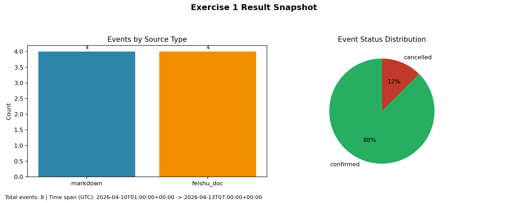
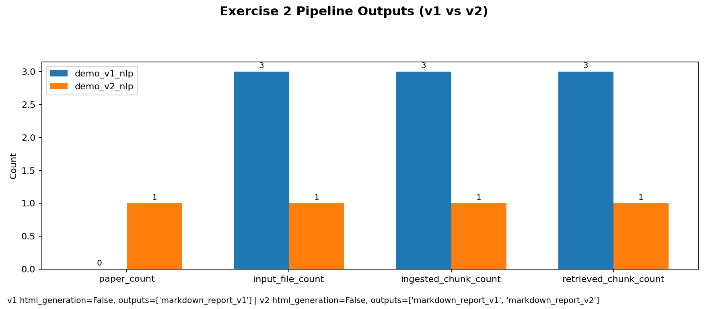
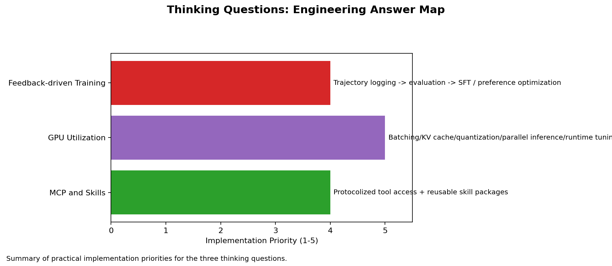

# Agent-Beginner 基本练习报告

本报告按照仓库文档的要求，简要说明两个任务的实现方式、结果现象和个人思考。

## 练习一：智能体体验与原理初探

### 文档要求
练习一要求搭建一个个人日程助手，能够调用自定义工具完成日程的创建、修改、查询和删除，并且能够从聊天记录、飞书文档和 Markdown 笔记中抽取日程信息。

### 核心实现
本项目使用 `NexAU` 搭建工具调用型 Agent。入口文件是 `/exercise1_nexau/run_scheduler_agent.py`，主要负责读取模型配置、初始化数据库，并把日程相关工具注册给 Agent。这样模型只负责决定“调用哪个工具”，具体的数据处理和写库逻辑交给本地代码执行。

具体业务实现在 `/exercise1_nexau/scheduler_tools.py`。实现思路是把不同来源的输入统一转换成文本，再复用同一套抽取逻辑。代码会从每一行中识别时间表达，解析成结构化时间，再生成事件标题和描述并写入 SQLite。对于 `upsert` 模式，会根据“同一天、同标题”的规则判断是新建还是更新。对于删除操作，系统不会直接删除，而是要求确认后把状态改为 `cancelled`。对于冲突日程，系统会先阻断写入并返回冲突信息。

飞书部分除了支持导出后的 Markdown，还支持开放平台直连。实现中既能处理 `docx` 链接，也能处理 `wiki` 链接；如果输入是 `wiki`，代码会先把 `wiki token` 解析成真实文档 token，再读取文档原文内容并抽取日程。

### 结果展示

从结果图可以看到，当前数据库共有 `8` 条事件，其中 `feishu_doc=4`、`markdown=4`，说明飞书文档和 Markdown 两类来源都已经接入成功。状态分布为 `confirmed=7`、`cancelled=1`，说明删除操作采用的是“取消日程”而不是直接删库，也和实现中的安全策略一致。结合之前飞书同步结果中的 `updated_count=2`，可以说明系统不仅能导入日程，也已经具备更新已有日程的能力。

### 简短思考
练习一的关键不是接入模型，而是把工具调用、时间解析、多源导入和安全控制串成一条稳定链路。当前实现已经满足课程要求；如果继续完善，最值得补的是更强的事件匹配策略和更完整的操作日志。

## 练习二：NexDR 的理解与修改

### 文档要求
练习二要求在理解 NexDR 的基础上完成三项修改：用 Semantic Scholar 替代网络搜索、不再生成 HTML 而改为 Markdown 迭代修订、支持 PDF 和图片等更多输入。

### 核心实现
主入口是 `/exercise2_nexdr/run_exercise2.py`。整体流程分成四步：搜索论文、读取输入文件、生成 Markdown 报告、在用户修改后继续修订。

搜索部分在 `/exercise2_nexdr/search/semantic_scholar.py` 中实现。代码调用 Semantic Scholar API 获取论文结果，再根据相关性、年份和引用数做重排；如果遇到 `429` 或 `5xx`，则返回空结果，让系统继续生成报告而不是整体失败。

Markdown 迭代部分由 `/exercise2_nexdr/revision/diff_parser.py` 和 `/exercise2_nexdr/revision/revision_engine.py` 完成。实现方式是先比较旧稿和用户编辑稿的差异，再把这些差异和用户新要求一起交给模型，让模型在“用户编辑版”基础上做进一步修订，因此用户修改内容不会被重新覆盖。

多模态输入部分在 `/exercise2_nexdr/ingestion/multimodal_ingestor.py` 中实现。文本文件直接读取，PDF 优先抽文本，失败时再转图片做 OCR，图片则优先使用本地 OCR，不行再回退到多模态模型。这种分层 fallback 方式更适合实际环境。

### 结果展示

结果图展示了两个工作空间。`demo_v1_nlp` 中 `input_file_count=3`、`ingested_chunk_count=3`、`retrieved_chunk_count=3`，说明文本、PDF、图片三类输入已经可以进入同一条流程。两个实验的 `html_generation` 都为 `false`，说明 HTML 输出已经被真正禁用。`demo_v2_nlp` 比 `demo_v1_nlp` 多出 `markdown_report_v2.md`，说明“用户先修改 Markdown，再让 Agent 继续修订”的第二轮流程已经跑通。图中 `paper_count` 从 `0` 到 `1` 的变化也说明学术搜索受外部 API 状态影响，因此搜索模块必须具备容错能力。

### 简短思考
练习二的重点不是单独改某个文件，而是理解 NexDR 的主链路后，在不破坏整体结构的情况下替换关键组件。当前实现已经覆盖文档中的三项要求；如果继续优化，应该优先补更稳定的 OCR 和更完整的搜索集成测试。

## 思考题

### RQ1：熟悉 MCP 和 Skills，总结常见的使用方法
MCP 适合接入外部系统能力，例如数据库、知识库、企业平台 API；Skills 适合沉淀固定任务流程，例如检索、总结、修订。前者解决“如何接能力”，后者解决“如何组织能力”，在实际系统中通常需要一起使用。

### RQ2：如何提高 Agent 部署时显卡使用率及运行
提高显卡利用率应从推理框架、请求模式和模型部署三层优化。常见做法包括使用支持连续批处理的推理框架、减少碎片化请求、启用 KV Cache 和量化，并结合吞吐、延迟、显存占用等指标持续调参。

### RQ3：如何利用环境的反馈训练更好的 Agent
核心是建立“采集、评估、优化”的闭环。先记录用户输入、工具调用和人工修订，再把这些反馈结构化为可评估指标，最后用于监督微调、偏好优化或离线策略改进。练习一中的冲突检测和练习二中的用户改稿，其实都已经体现了环境反馈对 Agent 行为的约束作用。

